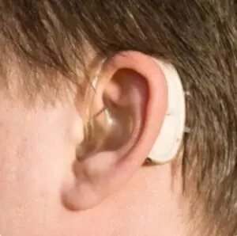

# AuriMold (Hackafono)

> Pipeline computacional open-source para geração automatizada de moldes auriculares 3D anatomossensíveis, otimizados para impressão em silicone de próteses auditivas infantis.



## Visão Geral

O AuriMold processa escaneamentos 3D de orelhas de bebês (`.stl`) e gera automaticamente moldes 3D prontos para fabricação em silicone. O pipeline executa:

1. **Segmentação Anatômica** — Identificação e extração da concha e meato acústico externo via análise de curvatura Gaussiana.
2. **Perfuração Paramétrica** — Escavação do canal de condução acústica com operação booleana de subtração e validação de espessura de parede.
3. **Relatório de Conformidade** — Validação clínica automatizada via integração com LLMs gratuitos (OpenRouter / HuggingFace).

## Estrutura do Projeto

```
infant-earmold-pipeline/
├── assets/
│   └── docs/
│       ├── scan_trim_region.png        # Referência: região de corte
│       ├── earmold_tunnel_path.png     # Referência: trajetória do tubo
│       └── bte_fitting_reference.png   # Referência: encaixe BTE
├── samples/
│   └── RAVI_2.stl                      # Escaneamento 3D de entrada
├── src/
│   ├── __init__.py
│   ├── segmentation.py                 # Desafio 0: Segmentação
│   ├── borehole.py                     # Desafio 1: Perfuração
│   └── main_pipeline.py               # Desafio 2: Orquestração
├── output/                             # Resultados processados
├── requirements.txt
└── README.md
```

## Instalação

### Pré-requisitos

- **Python 3.10+**
- **pip** (gerenciador de pacotes)

### Configuração do Ambiente Virtual

```bash
# 1. Criar o ambiente virtual
python -m venv .venv

# 2. Ativar o ambiente virtual
# Windows (PowerShell):
.venv\Scripts\Activate.ps1
# Windows (CMD):
.venv\Scripts\activate.bat
# Linux / macOS:
source .venv/bin/activate

# 3. Instalar dependências
pip install -r requirements.txt
```

### Variáveis de Ambiente (Opcional — Integração IA)

Para ativar a geração de relatórios de conformidade via LLM:

```bash
# OpenRouter (rota gratuita — Gemma 2 / Llama 3)
export OPENROUTER_API_KEY="sk-or-v1-sua-chave-aqui"

# HuggingFace (fallback)
export HF_API_TOKEN="hf_sua-chave-aqui"
```

> **Nota:** A integração IA é **opcional**. Sem as chaves, o pipeline gera um relatório local automaticamente.

## Uso

### Execução Padrão (CLI)

```bash
python src/main_pipeline.py \
    -i samples/RAVI_2.stl \
    -o output/molde_final.stl
```

### Com Parâmetros Clínicos Personalizados

```bash
python src/main_pipeline.py \
    -i samples/RAVI_2.stl \
    -o output/molde_final.stl \
    --diametro 2.5 \
    --folga 0.4 \
    --angulo 20 \
    --espessura-min 1.5
```

### Com Integração IA

```bash
python src/main_pipeline.py \
    -i samples/RAVI_2.stl \
    -o output/molde_final.stl \
    --openrouter-key "sk-or-v1-sua-chave" \
    -v
```

### Argumentos CLI

| Argumento | Tipo | Default | Descrição |
|---|---|---|---|
| `-i`, `--input` | `str` | **obrigatório** | Caminho do `.stl` de entrada |
| `-o`, `--output` | `str` | **obrigatório** | Caminho do `.stl` de saída |
| `--diametro` | `float` | `2.0` | Diâmetro do tubo acústico (mm) |
| `--folga` | `float` | `0.3` | Tolerância de fabricação (mm) |
| `--angulo` | `float` | `15.0` | Ângulo de inserção (graus) |
| `--espessura-min` | `float` | `1.2` | Espessura mín. da parede (mm) |
| `--openrouter-key` | `str` | `None` | Chave da API OpenRouter |
| `--hf-key` | `str` | `None` | Chave da API HuggingFace |
| `-v`, `--verbose` | flag | — | Logs detalhados (DEBUG) |

## Saídas

O pipeline gera os seguintes artefatos no diretório `output/`:

| Arquivo | Descrição |
|---|---|
| `molde_final.stl` | Malha 3D processada e pronta para fatiador |
| `molde_final.report.txt` | Relatório de conformidade clínica |

## Módulos Executáveis Individualmente

Cada módulo pode ser executado de forma standalone para depuração:

```bash
# Somente segmentação
python src/segmentation.py samples/RAVI_2.stl

# Somente perfuração (requer malha já segmentada)
python src/borehole.py output/segmented.stl
```

## Stack Tecnológica

| Componente | Tecnologia |
|---|---|
| Core Geométrico | Trimesh, Open3D, NumPy, SciPy |
| Motor Booleano | manifold3d (primário), Blender bpy (fallback) |
| Integração IA | OpenRouter API (free), HuggingFace Inference |
| Linguagem | Python 3.10+ com type hints |

## Referências Técnicas

- **Curvatura Gaussiana Discreta**: Déficit angular de Descartes — `K(v) = 2π − Σ θⱼ`
- **Rotação de Rodrigues**: Alinhamento do cilindro com vetor diretriz do conduto acústico
- **Ray Casting Radial**: Validação de espessura mínima de parede via amostragem angular

## Licença

MIT License — Consulte o arquivo `LICENSE` para detalhes.
